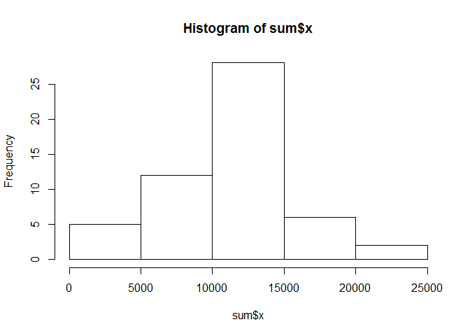
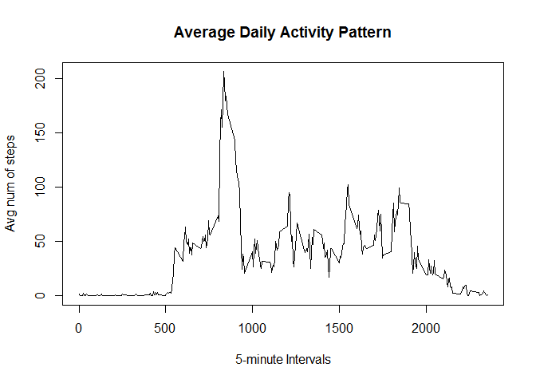

# Reproducible Research: Peer Assessment 1


## Loading and preprocessing the data
First you have to set your working directory to where you cloned the git depository to first. Then you load the data into R:

```r
data<-read.csv(unz("activity.zip","activity.csv"))
```

## What is mean total number of steps taken per day?
To make a histogram of the total number of steps taken each day:

```r
sum<-aggregate(data$steps,list(date=data$date),sum)
hist(sum$x)
```

 

The mean total number of steps taken per day is

```r
mean(sum$x,na.rm=TRUE)
```

```
## [1] 10766
```

The median total number of steps taken per day is

```r
median(sum$x,na.rm=TRUE)
```

```
## [1] 10765
```
## What is the average daily activity pattern?

```r
avg<-aggregate(data$steps,list(Interval=data$interval),mean,na.rm=TRUE)

plot(avg$Interval,avg$x,main="Average Daily Activity Pattern",xlab="5-minute Intervals",ylab="Avg num of steps",type="l")
```

 

The inverval that contains the maximum number of steps is

```r
avg[which.max(avg$x),1]
```

```
## [1] 835
```

## Imputing missing values
The total number of missinv values in the dataset is

```r
sum(is.na(data$steps))
```

```
## [1] 2304
```

## Are there differences in activity patterns between weekdays and weekends?
